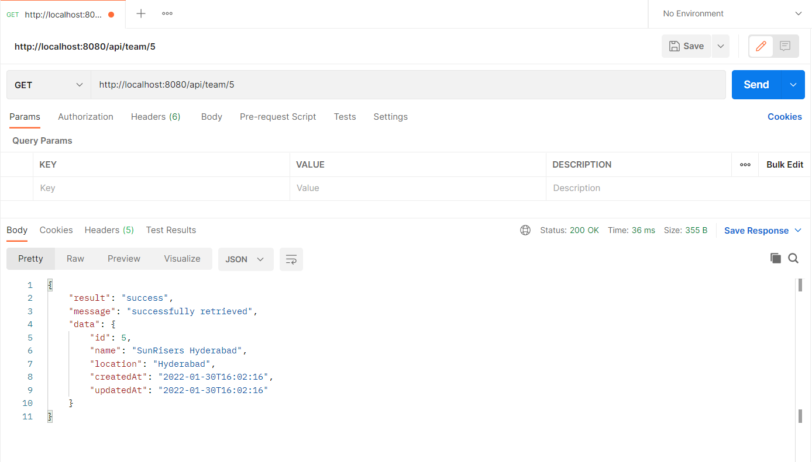
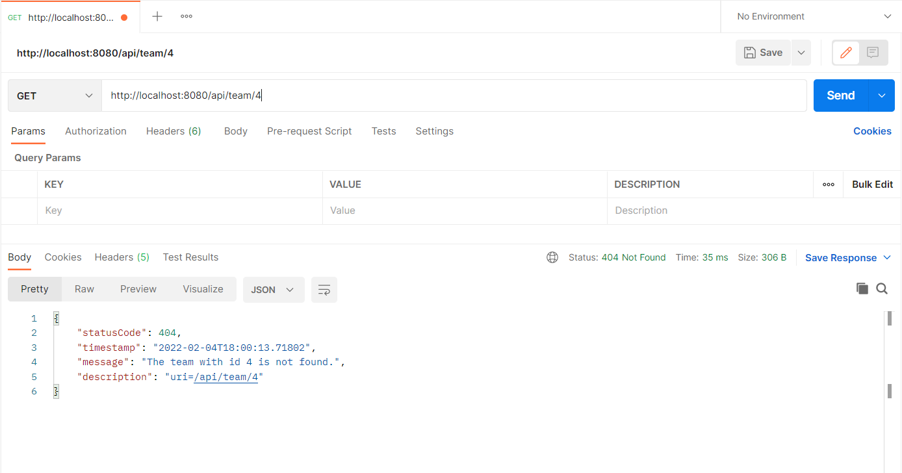
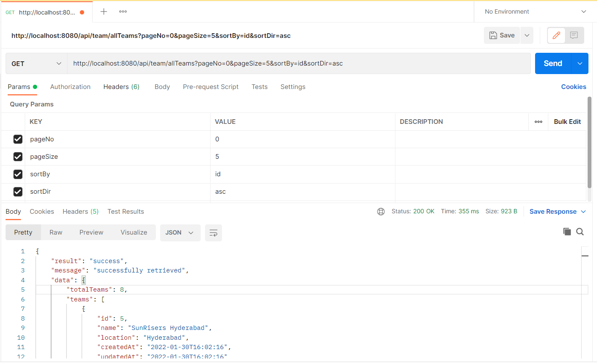
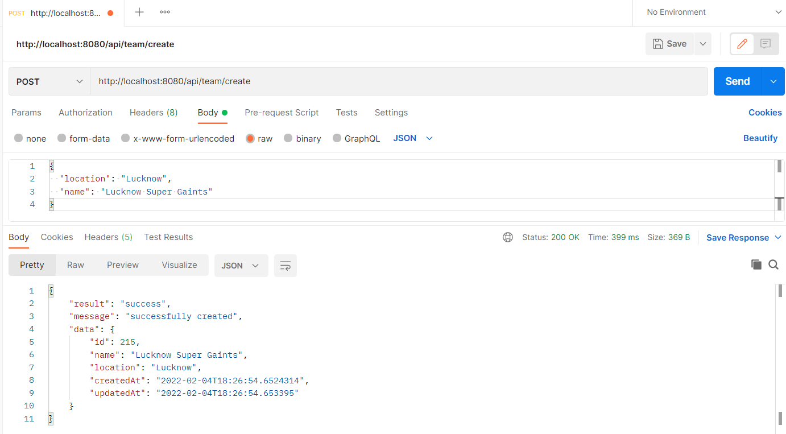
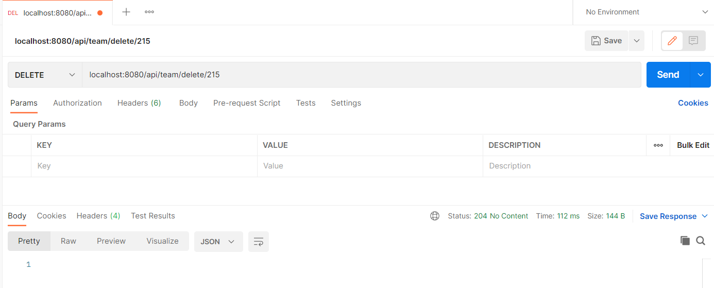
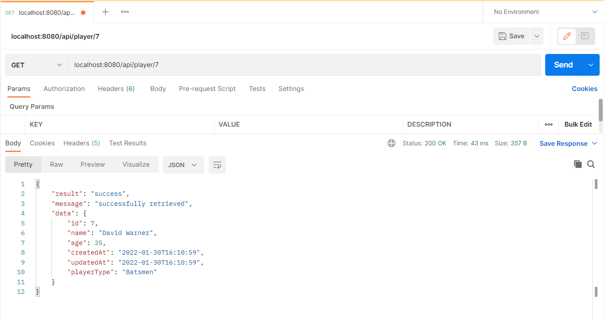
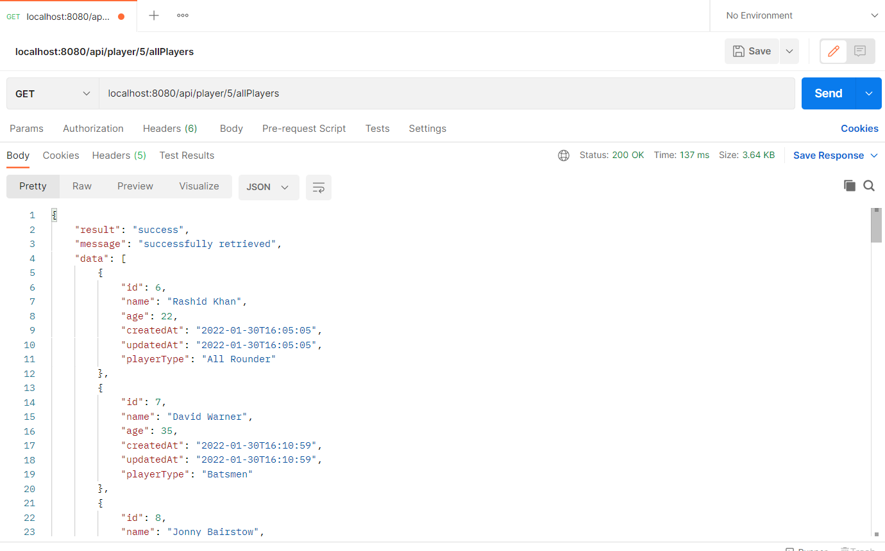
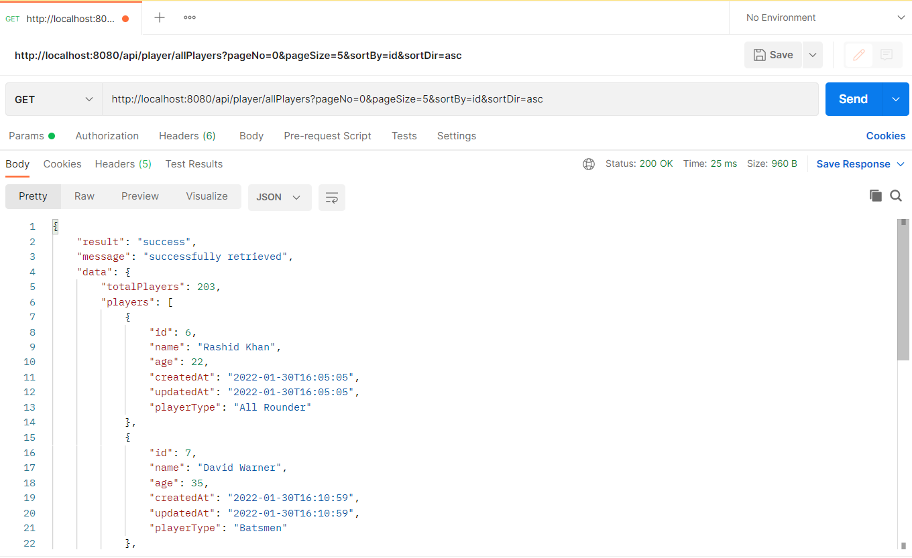
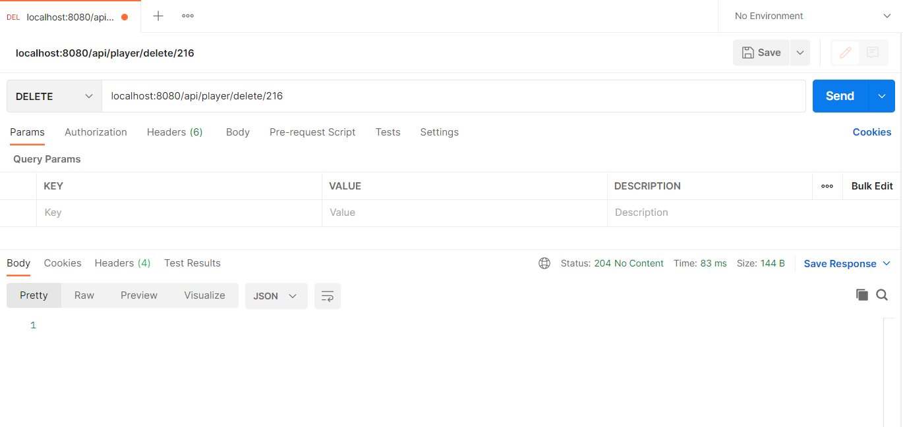
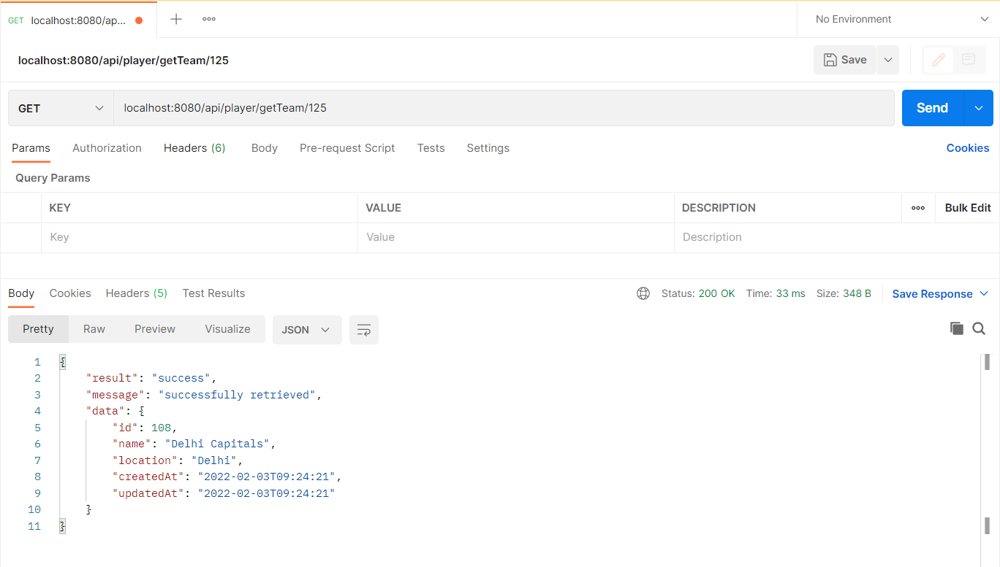

# tournament-management
A simple spring boot backend to manage your tournament with players and teams

## Let's have a look at all the end points we have:
There are mainly two entities, teams and players, let's have look at endpoints involving them separately.

#### Endpoints dealing with team:

| Endpoint                     | Brief Description                                   |
|------------------------------|-----------------------------------------------------|
| GET /api/team/{id}           | Retrieve the team based on its id                   |
| GET /api/team/allTeams       | List out all teams based on paging query parameters |
| POST /api/team/create        | Creates a new team based on the body                |
| DELETE /api/team/delete/{id} | Delete the team based on given id                   |
| PUT /api/team/update/{id}    | Update the team with given id and body              |

#### Endpoints dealing with player:

| Endpoint                            | Brief Description                                         |
|-------------------------------------|-----------------------------------------------------------|
| GET /api/player/{id}                | Retrieve player based on his id                           |
| POST /api/player/{teamId}/addPlayer | Creates a new player and add him to the team id mentioned |
| GET /api/player/{teamId}/allPlayers | Retrieves all players of the team mentioned with team id  |
| GET /api/player/allPlayers          | Retrieves all players based on the paging query params    |
| DELETE /api/player/delete/{id}      | Deletes the player based on his id                        |
| GET /api/player/getTeam/{id}        | Retrieve the team of a player based on his id             |
| PUT /api/player/update/{id}         | Update the player details based on player id              |

#### Now let's checkout about each endpoint in detail:

#### Retrieving the team based on it's id:

the above pic shows the retrieval team based on it's id.

The below pic shows the response if we check for a non-existent team.


#### Viewing all teams
The below pic shows the request, and the json below it shows the response

```json
{
    "result": "success",
    "message": "successfully retrieved",
    "data": {
        "totalTeams": 8,
        "teams": [
            {
                "id": 5,
                "name": "SunRisers Hyderabad",
                "location": "Hyderabad",
                "createdAt": "2022-01-30T16:02:16",
                "updatedAt": "2022-01-30T16:02:16"
            },
            {
                "id": 31,
                "name": "Royal Challengers Bangalore",
                "location": "Bangalore",
                "createdAt": "2022-02-03T06:20:45",
                "updatedAt": "2022-02-03T06:20:45"
            },
            {
                "id": 57,
                "name": "Mumbai Indians",
                "location": "Mumbai",
                "createdAt": "2022-02-03T09:00:31",
                "updatedAt": "2022-02-03T09:00:31"
            },
            {
                "id": 83,
                "name": "Chennai Super Kings",
                "location": "Chennai",
                "createdAt": "2022-02-03T09:14:25",
                "updatedAt": "2022-02-03T09:14:25"
            },
            {
                "id": 108,
                "name": "Delhi Capitals",
                "location": "Delhi",
                "createdAt": "2022-02-03T09:24:21",
                "updatedAt": "2022-02-03T09:24:21"
            }
        ],
        "totalPages": 2,
        "currentPage": 1
    }
}
```
Please observe the query parameters on the request,
- **pageNo**: defines the index of the page starts from zero
- **sortBy**: defines the parameter of the entity to sort based on
- **pageSize**: size of the page
- **sortDir**: sort whether ascending("asc") or descending("desc")

If you don't input any query parameters the params will default to the one's shows in request in above image.
#### Creating a new team

The above image creates a new team named *Lucknow Super Gaints*.

#### Update a team based on it's id

The above image updates the name of team to *Lucknow Mega Gaints*. Also observe the created time and updated time in image.

#### Delete a team based on it's id

The above image shows a request deleting a team successfully. 

**note**: deleting a team also deletes its players.

#### Retrieve a player based on his id

The above image shows retrieving the player based on his id.

#### Create a player

The above image creates a player and maps it to team with id 5.

The player type only accepts either of these values below(case-insensitive):
- *all rounder*
- *batsmen*
- *bowler*
- *wicket keeper*

#### Retrieve all players of a team

The above image shows the list of players of team with id **5**.

#### Retrieve all players

The request in above image shows all the players based on the given pagination query parameters.
**Note**: The params meaning is same as mentioned above in *viewing all teams*.

If you don't input any query parameters the params will default to the one's shows in request in above image.

#### Deleting a player

The request in above image deletes a player using his id.

#### Retrieve team of a player

The request in above image shows the team of a player with id 125.

#### Update a player

The request in above image updates the player's details. observe the created time and updated time.

All of the above images and content explains about the working of api.

Please find the postman collection of API endpoints [here](resources/Players_Teams.postman_collection.json) to try them on your own.

Please find the generated swagger doc [here](resources/api-docs.json)
